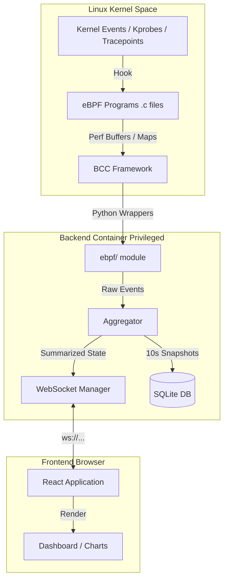

# EBPFScope Study Guide: Created By Sandesha Wakchaure

Welcome to the **EBPFScope** study guide. This document explains the complete architecture, how each component works, the role of every key file, and the data flow from the Linux kernel all the way to the frontend UI.

---

## 1. Project Overview

**EBPFScope** is a full-stack, real-time Linux observability platform. It allows deep inspection of the system at the kernel level without modifying kernel source code or loading vulnerable modules. It uses **eBPF (Extended Berkeley Packet Filter)** to collect metrics (File I/O, Syscalls, Network, CPU Profiling, OOM events) and visualizes them on a modern React dashboard via WebSockets.

### Core Technology Stack
*   **Kernel Level:** eBPF (C code), BCC (BPF Compiler Collection)
*   **Backend Server:** Python, FastAPI, asyncio, WebSockets, aiosqlite (SQLite)
*   **Frontend Client:** React 18, TypeScript, Tailwind CSS, Vite
*   **Infrastructure:** Docker, Docker Compose, Nginx

---

## 2. High-Level Architecture (Flowchart)

---

## 3. Directory Structure & Key Files Explained

### The Root Directory
*   **`docker-compose.yml`**: Defines the 3 containers (`backend`, `frontend`, `nginx`). Notably, the `backend` container requires `privileged: true`, `pid: host`, and capabilities like `SYS_ADMIN` and `BPF` to interact with the host's kernel. This is essential for eBPF code loading.
*   **`nginx.conf`**: Nginx configuration acting as a reverse proxy, routing to the frontend or backend (including WebSocket upgrading).
*   **`.env`**: Stores environment variables like `EBPFSCOPE_API_KEY`.

---

### Backend (`/backend`)
The backend is responsible for compiling and loading the eBPF C code into the kernel, reading the events continuously, aggregating them, and broadcasting them via WebSockets to the frontend.

#### 1. Entry Point and Configuration
*   **`main.py`**: The FastAPI application entry point. It sets up CORS, mounts REST API routers (from `api/`), initializes the database on startup, starts the aggregation loop, and establishes the `/ws` WebSocket endpoint.
*   **`config.py`**: Pydantic base settings, loading config values from the `.env` file.

#### 2. The Aggregation Engine
*   **`aggregator.py`**: The "heartbeat" of the backend. It instantiates all eBPF trackers (`SyscallTracer`, `FileTracker`, etc.). It coordinates them inside a continuous loop (`aggregate_loop`) running every 1 second, fetching raw events from the trackers, summarizing them into an aggregate payload, broadcasting over WebSockets, and conditionally saving it to SQLite.

#### 3. BPF C Source Code (`bpf/`)
This is where the actual eBPF code lives. It is written in restricted C.
*   **`syscall_tracer.c`**: Hooks into `sys_enter` and `sys_exit` tracepoints to measure syscall metrics.
*   **`file_tracker.c`**: Hooks into the Virtual File System functions (`vfs_read`, `vfs_write`, `vfs_open`) using `kprobes`. Measures I/O bandwidth and latency.
*   **`network_tracer.c`**: Attaches to TCP/IP networking stack functions (`tcp_v4_connect`, etc.) to monitor network associations and dropped packets.
*   **`cpu_profiler.c`**: Samples running processes executing on the CPU at a fixed frequency (e.g., 99Hz) gathering comprehensive stack traces for Flame Graphs. 
*   **`oom_watcher.c`**: Tracks kernel Out-Of-Memory (OOM) killer invocations.

#### 4. Python eBPF Wrappers (`ebpf/`)
Connects the low-level BCC outputs to the Python application.
*   **`loader.py`**: A utility that loads and compiles the `.c` files via BCC.
*   **`syscall.py, files.py, network.py, profiler.py, oom.py`**: These classes wrap the compiled BPF programs. They start an async background task to read from the eBPF perf ring buffers (like `bpf.perf_buffer_poll()`), parse struct attributes using `ctypes`, and store them as lightweight dictionaries in Python arrays until the aggregator picks them up.

#### 5. Storage & Utilities
*   **`database.py`**: Provides asynchronous SQLite operations (`aiosqlite`) to persist metrics periodically, enabling historical dashboard queries.
*   **`websocket.py`**: A connection manager holding active client connections and broadcasting JSON messages concurrently.
*   **`flamegraph.py`**: Takes raw stack-trace counts parsed from BPF and transforms them into standard FlameGraph hierarchical JSON structures suitable for the frontend.

---

### Frontend (`/frontend`)
The single-page application built on React. It reacts to the real-time stream broadcasted by the backend server.

#### 1. Entry Point & UI Shell
*   **`src/main.tsx`**: React DOM injection. Sets up `react-router-dom` for client-side routing.
*   **`src/App.tsx`**: The main layout wrapper. Instantiates the global `Sidebar` and `TopBar`, and kicks off the `useWebSocket` hook tying the UI to backend updates.

#### 2. Hooks & State Management (`src/hooks/`)
*   **`useWebSocket.ts`**: Connects via WebSockets to the server. On receiving a server message (every 1s), it unpacks the full application state, and stores it in React state, triggering UI re-renders for all listening components.
*   **`useProcessFilter.ts`**, **`useAlerts.ts`**: Specialized functional hooks manipulating portions of the massive UI data feed.

#### 3. Pages (`src/pages/`)
Each file here represents a distinct dashboard view.
*   **`Dashboard.tsx`**: Contains high-level overview metrics, CPU flamegraph insights, and system summary alerts.
*   **`Processes.tsx`, `Files.tsx`, `Network.tsx`, `Alerts.tsx`**: Consume the shared websocket state context via `useOutletContext()` and inject it down to specific data components showing detailed views.

#### 4. Components (`src/components/`)
Reusable pieces of UI.
*   **`ProcessTable.tsx`**, **`SyscallHistogram.tsx`**: Detailed visual tools for tracking application behavior across processes. 
*   **`FlameGraph.tsx`**: Renders dynamic, interactive D3-style stack trees (built directly using React/SVG or div trees) showing where CPU time is being spent system-wide.
*   **`NetworkFlow.tsx`**: Visualizes IP flows, bandwidth consumption, and data transfers.

---

## 4. The Anatomy of an eBPF Trace (Data Flow Example)

Let’s trace exactly how a single system operation (e.g., **Syscall**) is tracked and visualized down to the pixels on the screen:

1.  **Kernel Execution**: A program (like `curl`) requests kernel resources using an `openat` syscall. The Linux kernel predictably invokes the `sys_enter_openat` and later `sys_exit_openat` locations.
2.  **eBPF execution (`syscall_tracer.c`)**: BPF program hooks intercept execution. At entry, it records a precise timestamp. At exit, it calculates duration, puts metadata (PID, duration in ns, target command) into a C `struct event_t`, and submits the payload to a BPF Perf Buffer queue.
3.  **Python wrapper (`syscall.py`)**: Our Python async task runs `perf_buffer_poll()`. It wakes up and populates the data from memory buffer. It maps C structures into Python `dict`s and stores them locally.
4.  **Coordinator (`aggregator.py`)**: Precisely once a second, it strips all Python dicts collected, resets memory, calculates percentile latency numbers (p50, p95, p99 latencies), encapsulates them inside a unified `state` JSON dictionary, and hands it off to `wsm.broadcast()`.
5.  **Data Wire Transport**: The JSON message travels via the active WebSocket channel directly to an open browser tab.
6.  **React Hook (`useWebSocket.ts`)**: `ws.onmessage` receives the JSON payload and triggers `setState()`. 
7.  **React Repaint (`SyscallHistogram.tsx`)**: React identifies variables mapped to states have altered. It calculates a virtual DOM diff and forces an immediate render. The Syscalls bar chart on the UI extends or changes color!

---

## 5. Key Architecture Learnings & Notes
*   **Privileged Containers**: Utilizing deep observability metrics via eBPF requires a privileged Docker footprint because programs are dynamically loaded into the host Linux kernel logic structure itself.
*   **BCC JIT compilation**: The backend container automatically relies on the `bcc` library framework. EBPF source codes (.c) aren't shipped pre-compiled. Instead, Python BCC dynamically triggers LLVM/Clang to JIT compile them precisely against running kernel headers right as `EBPFScope` launches.
*   **Extremely Low Overhead**: Since eBPF operates internally gathering and summarizing metrics directly within kernel space without massive context-swapping, it scales better than traditional `strace` or agent-based process polling tools.

You now possess a high-definition grasp of how the **EBPFScope** application brings modern cloud-native system observability to reality.
